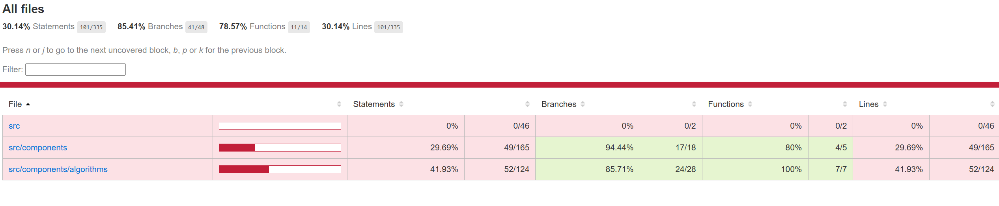

# Testausdokumentti

## Testausvälineet
Testaukseen käytetään Vitest ohjelmistoa jolla tehdään yksikkötestejä ja tutkitaan testikattavuutta.

## Mitä testataan
Jotta testaaminen olisi mielekästä, olen yrittänyt jakaa ohjelmiston koodin useisiin pieniin funktioihin, joiden toimintaa on helppo testata. Ohjelma yrittää luoda käyttäjän syötteen mukaisen määrän huoneita satunnaisiin sijainteihin "kartalle". Satunnaisuuden poistamiseksi testauksesta käytetään SeedRandom kirjastoa ja sitä kautta syötetään seed arvo testauksessa. 
Tärkein olisi testata kaikkia luotuja algoritmeja ja niiden osioita yksitellen. 

Käyttöliittymän testaus, ei ole vielä mukana suunnitelmissa, mutta Playwright tai Cypress olisi helppo lisätä tähän jotta käyttöliittymää voisi testata. Käyttöliittymän React komponentit on rajattu pois testauksesta, mutta kaikki mahdollinen logiikka jonka pystyi irroittamaan käyttöliittymä komponenteista on yksikkötestauksen piirissä. 

Käyttöliittymän React komponentit on eristetty pois testauskattavuuden laskelmista.

Viimeisimpänä lisäyksenä testauksessa hyödynnetään Github actions toimintoja ja yksikkötestit ajetaan jokaisen pushauksen yhteydessä. 

## Delaunay triangulaation testaus
Triangulaation testauksessa hyödynsin tunnettua kaavaa triangulaatiossa syntyvien kolmioiden määrän laskemiselle

**Kolmioiden määrä = 2n - 2 - k (jossa n on kaikkien reittipisteiden määrä ja k on konveksisen hilan reunapisteiden määrä)**

Esimerkkinä pisteet jotka muodostavat neliön, näille triangulaatio muodostaisi (2 * 4 -2 -4 = 2) kaksi kolmioa.
Jos "neliön" sisällä olisi vielä yksi piste, laskukaavan mukaan saataisi kolmioiden määräksi (2 * 5 -2 -4 = 4) neljä.
Hahmottelin paperille parin eri triangulaation konveksisen hilan pisteet, sekä joitain hilan sisään jääviä pisteitä ja laskin testeihin laskukaavalla oikeat vastaukset. Näihin kuuluu myös selkeä kolmen pisteen muodostaman kolmion triangulaatiossa muodostuva yksi kolmio. 

Triangulaation suhteen testataan myös että kaikki annetut huoneet ovat triangulaation lopputuloksessa mukana eikä lopputulokseen ole päätynyt algoritmin alussa käytettävän superkolmion pisteitä. 

## Minimum spanning tree algoritmin testaus

Pienimmän virittävän puun etsivää Primin algoritmia testattiin käsin kasatuilla triangulaatioilla jotka luotiin ohjelmiston omalla triangulaatio algoritmilla. Toistaiseksi käytössä on aika pieniä triangulaatioita kolmiosta viisikulmioon.

Ensin testatataan että apufunktio (triangulationToEdges) osaa purkaa triangulaation reunoiksi ja antaa niille painon, tehden niistä listan weightedEdge tyyppisiä objekteja. Apufunktio palauttaa vain uniikit reunat ja tyhjän triangulaation kanssa se palauttaa tyhjän listan.

Myös apufunktio (getUniquePoints) testataan, jotta se osaa palauttaa vain uniikit pisteet.

Itse Primin algoritmin testauksessa hyödynnetään tietoa siitä että esim kolmion MST sisältää vain kaksi reunaa ja neliön sisältää kolme, yms yms (tässä toki käytetään hyvin yksinkertaisia kuvioita, jatkossa tähän tulisi kyllä kehittää jokin hieman hankalampikin). 

MST suhteen käytetään BFS algoritmia testaamaan että kaikkiin pisteisiin päästään kaaria pitkin. 

Asyklisyys todetaan testeissä pisteiden ja kaarien perusteella. 

**PUUTTEET: MST:tä ei ole vielä testattu sen suhteen että se tuottaisi oikeasti pienimmän virittävän puun. Tähän pitää vielä kehittää jokin käsin tarkistettu kokoelma pisteitä**

## A* testaus

A* algoritmin testauksessa käytetään itse kehitettyjä karttoja, joissa hyödynnetään Tile tyypin 'wall' tiilejä, joiden läpi algoritmi ei voi reitittää. Varsinaisessa ohjelmassa ei vielä mitenkään hyödynnetä 'wall' tiilejä vaan ne ovat vain testausta varten. 

Ensin on perus yksikkötestejä kuten varmistus että algoritmi löytää reitin yksinkertaisessa tapauksessa suoraan ja diagonaalisesti. Sitten varmistetaan että algoritmi ei yritä reitittää kartan ulkopuolelle. Pystyy löytämään reitin takaisin aloituspisteeseen. Palauttaa tyhjän reitin jos ei ole löydettävissä reittiä maaliin. Pystyy löytämään reitin maaliin jos sinne pääsee ainoastaan diagonaalisesti ja ei löydä reittiä maaliin jos diagonaalinen reititys on estetty käyttäjän asetuksena. 

Algoritmin oletetaan löytävän lyhin reitti yksinkertaisessa tapauksessa ja sitä testataan. Algoritmin tulee myös pystyä reitittämään esteiden ohitse ja se testataan. 

Tuotetun reitin jatkuvuus testataan, eli tarkistetaan että reitissä on joka pisteen välillä mahdollinen siirtyä joko diagonaalisesti tai ortogonaalisesti ja ettei sama piste toistu reitissä peräkkäin. Kaikki reitin pisteet myös tarkistetaan sen varalta että ne ovat kuljettavissa. 

Parilla yksikkötestillä myös tarkistetaan että käytävien luominen karttaan reitin perusteella onnistuu. 

## Miten testataan
Ohjelmiston testit voi ajaa komennolla 

**npm run test:run**

Testien kattavuusraportin saa komennolla

**npm run test:coverage**

Komento luo kansion coverage jonka sisältä src/index saa kattavuusraportin näkyviin.

## Testauskattavuus

Testauskattavuudesta on otettu pois React komponentit, niille ehkä kehitetään vielä oma E2E testi tai sitten ne vain jäävät käyttöliittymän renderöinnistä vastaavana pois testauksesta. Se mitä muita tiedostoja on jätetty testikattavuudesta pois selviää tiedostosta vitest.config.ts

